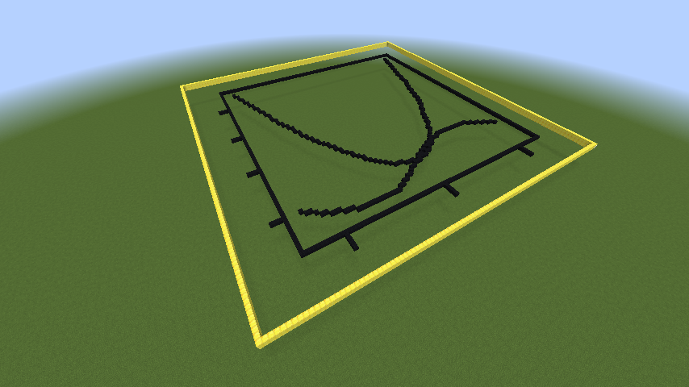
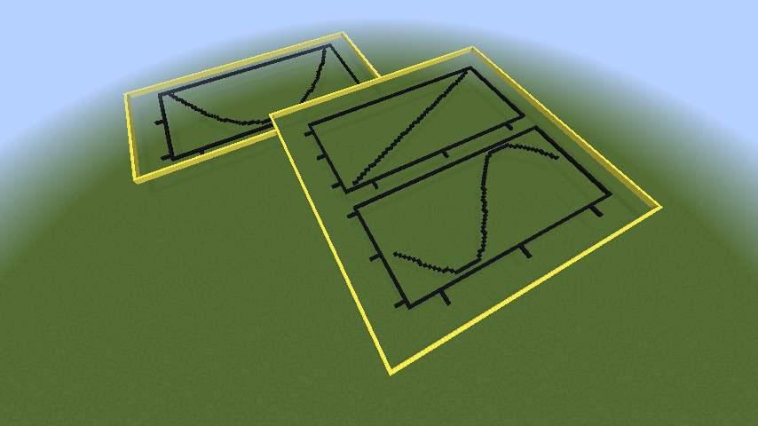
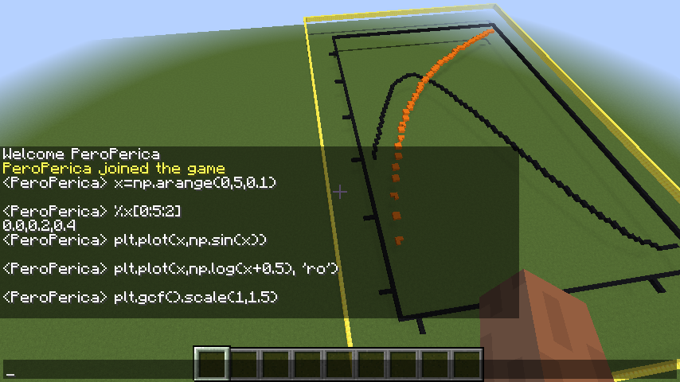

# Matplotlib - Minecraft Backend

Use your minecraft server as a GUI backend for Matplotlib. 

## Example 1 (noninteractive)

Run the script from root repo directory with
```bash
python example.py
```

```python
from mc_mpl.mde import MDE
import matplotlib.pyplot as plt
import matplotlib as mpl
import numpy as np
mpl.use("module://mc_mpl.mc_backend")

MDE().mc.player.setPos(0, 10, 0)

x = np.arange(-3, 3, 0.01)  # initialize the x axis range
plt.plot(x, x**2)
plt.plot(x, np.sin(x))
plt.show()  # rendering is initialized via plt.show()

input()  # since this is a GUI backend, you have to pause it, or it will auto-close
```



## Example 2 (noninteractive, with multiple figures/windows and movement)

Run the script from root repo directory with
```bash
python example_movement.py
```

```python
from mc_mpl.mde import MDE
import matplotlib.pyplot as plt
import matplotlib as mpl
import numpy as np
mpl.use("module://mc_mpl.mc_backend")

MDE().mc.player.setPos(0, 10, 0)

x = np.arange(-3, 3, 0.01)  # initialize the x axis range

plt.plot(x, x**2)
plt.gcf().move(50, 90)
plt.gcf().scale(1, 0.5)

fig, ax = plt.subplots(2, 1)
ax[0].plot(x, x)
ax[1].plot(x, np.sin(x))
plt.show()  # rendering is initialized via plt.show()

input()  # since this is a guy backend, you have to pause it, or it will auto-close
```


Notice the overlapping area. This can be controlled as in most desktop environments, by invoking a focus method on a window.
Make sure to check out the simplistic (and for now quite slow) desktop environment in mde.py file.

## Example 3 (interactive mode)

This mode enables you to use full python interpreter inside of minecraft, along with MPL plotting featurs.
Run it with (from root directory):

```bash
python -m mc_mpl.interactive
```
Example chat input and results:



This mode doesn't require you to invoke .show(), but instead calls GUI callbacks on every command to update the screen.
Commands starting with % are shortcuts for printing the result of the call (evaluating), instead of just executing it in current interpreter session.

## Installation

Requires Python3, jre/jdk, numpy and matplotlib to be installed.

1. Clone or download the git repository
2. Unpack minecraft server along with plugins, run it with the supplied bash script.
3. Login to your server, and check out the examples section to learn how to use it.

## Features

- Multiple figures, axis working natively.
- Full python interpreter in chat
- Desktop environment in the background, allowing for future extensions

Planned, but not implemented yet

- 3d plots
- Plotting text by using signs

## Contributing

1. Fork the repo
2. Do the bugfix/add a feature
3. Submit a pull request


## Contributors

For now, this is a solo project. If you want to contribute, feel free to send me a mail.

## Credits

- Minecraft team, for the game
- Craftbukkit team, for the server
- https://github.com/zhuowei, for python API to craftbukkit server (https://github.com/zhuowei/RaspberryJuice)
- http://fvcproductions.com, for README.md template

## License

[](http://badges.mit-license.org)
